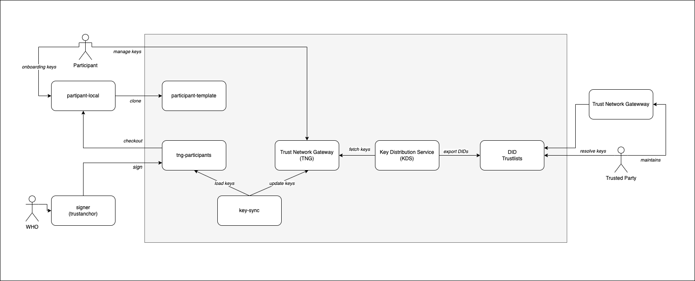
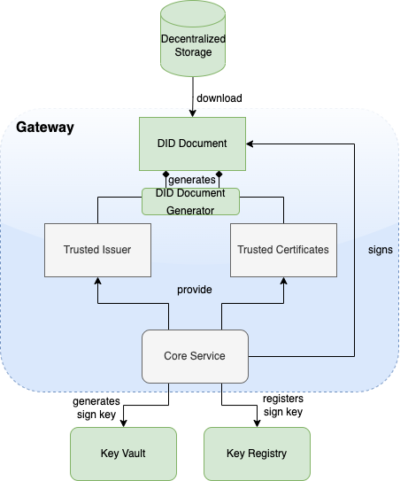
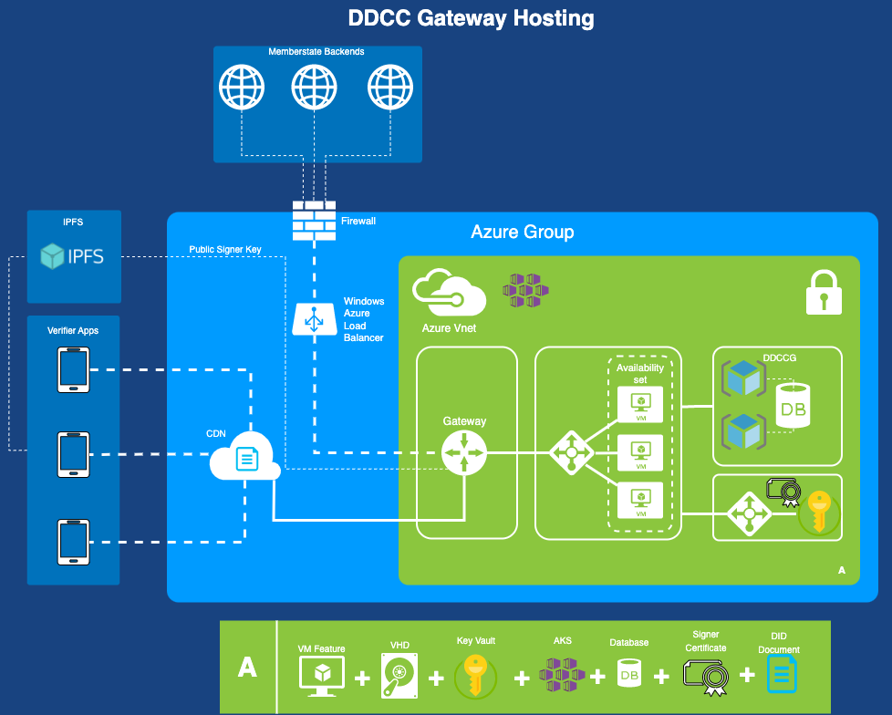
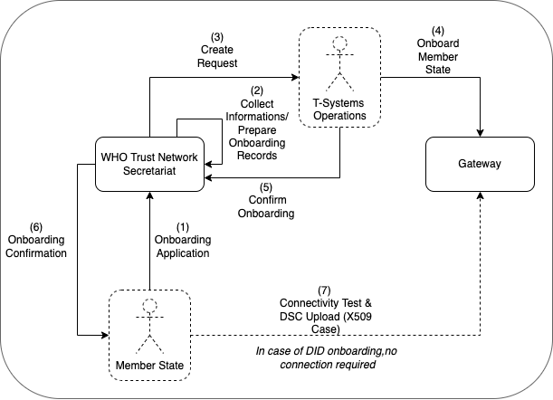

# Introduction

This architectural specification provides the means to establish a decentralized, federated trust network for use with health records and digital documentation, such as the WHO Digital Documentation of COVID-19 Certificates (DDCC). The core mission of this architecture is to transition from a centralized trust network model to a highly decentralized ecosystem. This is based on the assumption that Member States may establish their own independent national trust networks, participate in a regional trust network, or wish to participate in a global federated trust network. Furthermore Member States may wish for these trust networks to be interoperable for domestic and cross-jurisdictional use cases. In the latest evolution it is built natively on W3C Decentralized Identifier (DID) concepts.

At the heart of this architecture, the Trust Network Gateway (TNG) acts as the sovereign manager of trust key material for its trusted participants. Rather than relying on a single, monolithic central hub to distribute keys, the TNG manages and exposes this key material via read-access endpoints used for packaging trustlists natively as DID Documents. 

Simultaneously, the gateway can import external DID Documents as trusted references. If a member state, jurisdiction, or private participant sets up its own trust gateway and accompanying trustlist, it exposes its cryptographic keys as a DID Document. This exposed DID Document can then be securely imported as a trusted reference into other gateways. For instance, an imported DID Document can be ingested into the WHO Trust Network Gateway, where the associated key material is taken under the WHO governance scope. WHO then exposes this aggregated, verified key material as a global, DID-based trustlist. This mechanism forms the foundation of a highly flexible, decentralized trust network, empowering participants to build their own sovereign trust governance scopes, or seamlessly connect to broader, global trust boundaries.

As a brief history the architecture builds on the adopted [EU Digital Covid Certificate Gateway](https://ec.europa.eu/health/sites/default/files/ehealth/docs/digital-green-certificates_v2_en.pdf) solution. It extends it by allowing for federation and peer exchange of information between gateways following DID concepts and adherence to the X509 standards.

## Trusted Party vs. Sovereign Trust Boundary

In a strictly centralized model, participants act merely as "National Backends" uploading data to a central authority. In our decentralized DID-based architecture, any trusted party can act as an independent trust anchor. A participating jurisdiction manages its own trust boundary, curating its list of trusted issuers, and exposing its public trust posture as a DID Document. The WHO gateway, or any regional federator, simply acts as another node that imports these documents, applies its own governance policies, and republishes a unified DID Document for its constituents.

# Business Architecture Vision

The architectural vision embraces a shift from centralized synchronization to a narrative of decentralized discovery and continuous trust delegation using Decentralized Identifiers. In a centralized setup, an overarching gateway dictates the trust relationships for all connected parties. In this new DID-centric paradigm, trust is fundamentally distributed.

By using DID Documents to represent trustlists, the architecture empowers multiple operation modes natively. Gateways are no longer bound by proprietary synchronization protocols; instead, they resolve, import, and cache DID Documents from other sovereign gateways or trusted references. This enables a participant to securely reference the public keys of any other participant across the globe, effectively creating a web of trust rather than a hub-and-spoke model.

## Gateway Design Vision & Use Cases

The following use cases illustrate how the vision of adecentralized architecture facilitates trust establishment across varying operational boundaries, relying primarily on the exchange and resolution of X509 based key material contained in DID Documents. The gateway representing the core node that maintains trusted key material with ensuring secure handling and integrity of keys. It supports the import of key material from DID documents and the export of key material for embedding into DID documents. Such a connection of trustlists represents the foundation of trust networks. The gateway is designed to constitue a core node within such trust networks.

### Bilateral Trust Establishment
Two sovereign jurisdictions decide to mutually recognize each other's digital health credentials. Instead of integrating through a central global clearinghouse, they engage in a bilateral trust exchange. Each jurisdiction’s gateway exposes its national trustlist as a DID Document. They simply exchange their respective DIDs. Jurisdiction A imports Jurisdiction B’s DID as a trusted reference, and vice versa. Their gateways periodically resolve these DIDs to fetch the latest key material with read-access, instantly enabling bilateral verification of credentials while maintaining complete sovereign control over their trust boundaries.

### Decentralized Peer-to-Peer Network
A consortium of regional participants wants to form a tightly knit trust network. In this peer-to-peer narrative, every participant hosts their own gateway and exposes their trustlist as a DID Document. Each gateway is configured to import the DID Documents of the other peers as trusted references. As any participant updates their key material, their published DID Document is updated. The peer gateways, functioning as a decentralized web, independently resolve the updated DID Documents. This continuous, bi-directional resolution of DIDs ensures that the entire region stays synchronized without relying on a central coordination node.

### Hierarchical Trust Extension (e.g., WHO Global Governance Scope)
A global authority, such as the WHO, seeks to provide a unified trust baseline for global mobility without centralizing the issuance of keys. Member states operate their own national gateways, exposing their sovereign trustlists as DID Documents. The WHO gateway imports these national DID Documents as trusted references. The fetched key material is validated, taken under the WHO governance scope, and aggregated into a comprehensive, globally recognized DID-based trustlist exposed by WHO. Secondary participants—such as airlines, private verifiers, or member states lacking the resources to maintain independent peer-to-peer networks—can simply resolve the single WHO DID Document. This read-only integration provides them with a globally governed trustlist rooted in decentralized sources.

### Aggregated Trust Boundaries
A participant desires to build a highly customized trust boundary by combining multiple sources of trust. A national health authority might want to trust the global WHO network, a regional alliance, and a specific neighboring country. The authority configures its gateway to import the DID of the WHO trustlist, the DID of the regional alliance, and the DID of the neighboring country. The gateway seamlessly fetches the key material from all these DID Documents, merging them into a unified internal governance scope. This customized aggregation is entirely driven by the standard resolution of DID Documents.

### DID-Based Trust Mediation
When verifying entities (e.g., border control apps or health clinics) encounter credentials from unknown jurisdictions, the gateway acts as a trust mediator via DID resolution. If Verifier Device A receives a credential signed by Issuer B, the device queries its local gateway. Even if the local gateway does not have a direct relationship with Issuer B, it can resolve Issuer B’s DID. By checking if Issuer B's DID Document is cryptographically linked or referenced by a higher-level trusted DID (such as the WHO's trustlist), the gateway can dynamically mediate and establish trust. This allows loosely coupled entities to instantly verify authenticity based on the decentralized chain of trust anchored in DID Documents.

# Architecture Overview

The Trust Network Gateway purpose is to enable the secured and trusted exchange of data within a trust network.

  

## Data exchanged by TNG

### Public Key Exchange
TNG provides a secure and trusted way to share public keys that are used to sign digital health credentials.

### Reference Exchange
TNG provides the functionality to store and secure and trusted references, so that all attendees in the system have precise knowledge about important trust relationships. These references can be stored in the form of URLs.

### Issuer Exchange
For some Credential Types such as Verifiable Credentials, TNG is necessary to ensure the trust in issuers of those credentials. Most credentials carry an issuer ID such as an http URL or any DID where the public key material is behind to verify these credentials. To provide a trusted list of these issuers, the gateway provides functionality to upload issuer IDs.  

## Solution Concept
To realize the architectural vision, the existing Gateway will be enhanced by a microservice which implements the DID trustlist generation component. This so called Key Distribution Service (KDS) component is deployed next to the gateway and it handles synchronization of the gateways key material with the published trustlist. The published trustlists can be provided as trusted references to other trusted parties for federation. The trusted party can itself use the gateway for the governance of provided trustlist key material and the key distribution service for further federation based on their own published trustlist.

<b>Note</b>: The DCC Gateway core architecture remains untouched. Just backwards compatible enhancements will be introduced to support the federation.

### Connection Establishment to the Gateway
The DDCC specification provides interoperable standards for exchanging metadata content such as trusted references, trusted certificates and signer certificates with systems via a Trust Network Gateway. This metadata is managed through Trusted Systems which will need a connection/proxying or facade service with the Trust Network Gateway (“TNG Mediator”). This mediator must be onboarded and trusted by the operator of the TNG before a up/download of content is possible. Technically this can be a script, a backend system or an OpenHIM mediator. The main tasks of this kind of software is to establish a mTLS connection with the gateway, sign the uploaded content (e.g. CMS Cryptographic Message Syntax) and upload signed DSCs, revocation entries or releasing business rules. The procedures used in background is out of scope. There may be manual release processes, automatic decisions or other processes, however it is crucial to ensured that the trusted channel and the security of the used certificates for upload/tls connection are not compromised.

A solution for connection establishment implemented for WHO introduces a government process for onboarding trusted participants to the gateway. From business perspective the bilateral trust relationship is proven by applying a registration as trusted participant to WHO and with acceptance onboarding cryptographically proteccted keys to access the trust network gateway. From technical perspective, this process is imports X509 key material for access and authorization purpose via git repositories and a key synchronization service into the gateway and it's infrstructure. The key material is used to establish mTLS connection providing access to the gateway API and to validate if an issuer is authorized and trusted to upload key material.

## Building Blocks
The Trust Network Gateway consists of the DCC Gateway, supporting services like key distribution service and key sync service as well as repositories to maintain key material and trust list sources.

  

## Trust Model

### Overview
The trust model of the gateway is based on the [PKI certificate governance of the DCC Gateway](https://github.com/eu-digital-green-certificates/dgc-overview/blob/main/guides/certificate-governance.md). All security relevant items are uploaded in signed CMS format and secured by different kinds of PKI certificates as defined by the PKI certificate governance. The central items of the trust model are the CSCA to protect the Document Signer Certificates and the CMS messages to protect the uploaded content.

### CSCA & DSC
To sign digital COVID-19 certificates, a Document Signer Certificate (“DSC”) is created by an issuing authority. Each authority distributes their DSCs to verifiers, so that DSC can be used to prove the validity of an issued certificate. To establish a trust chain between used DSCs and the distributors of the national trust lists, each of the DSC is signed by a root authority (“CSCA”) to verify the authenticity of the DSC itself. For security reasons, the CSCA is declared as air gapped, and the public part is later on-boarded into the gateway. During the onboarding, the CSCA is signed by the operator of the gateway to give the trust in the initial check. After onboarding, each incoming DSC can be checked against the trusted CSCA. The operator signature (signed by DCCGTA) establishes the trust with different certificates such as the uploader certificate and the TLS authentication certificate as defined by the certificate governance.

  

### CMS Usage
To support multiple content in the gateway in the same security level, the trust model introduces CMS as a generic container for security relevant items. The CMS format allows it to standardize signing and encryption regardless of the content, for single or multiple recipients.

  

### Enhancement
The current trust model of the DCC Gateway supports only the connection of multiple backends and the exchange of content between them (see below).

  

To realize the architecture vision, the gateway trust model will be enhanced so that the federator can support multiple trust anchors. For this purpose, the TNG Federator will be onboarded in the source gateway with an NBTLS and NBUP certificate to access the gateway content. In the destination gateway, the trust anchor of the source gateway is configured (and signed by the operator) to accept the source content as valid. If the verification is successful, the content will be added as a subset to the existing gateway content. The connected national backends can then download all information by activating the federation option, to get the content from both gateways. The trust chain can be verified about the trust anchor of the connected gateway and the trust list of onboarded trust anchors.

  

<b>Note</b>: The Federator acts as a special kind of “National Backend”, therefore all NB associated certificates except the NBUP will be onboarded normally. 

### Raw Public Keys
The trust model doesn’t support raw public keys due to security reasons especially in cases where: 

Raw keys cannot be verified for validity
Raw key ca not be verified by the source (e.g. Root Authority)
Raw keys can be created and shared easily and bad governance “opens the door” to all participants in the trust network

Therefore all raw keys must be converted to an x509 certificate wrapper to be a DSC on the gateway, which must be signed by a properly onboarded CSCA. Verification of a COVID-19 certificate is not affected by this process, as long as the correct KID is applied during the upload (and in the certificate). 

### DSC Limitation

For legacy support, or any need for differentiation in the verification process such as for correct issuers or differentiation in KID calculation. It is recommended that the DSCs contain the following OIDs in the extended key usage field:

|Field|Value|Description|
|-----|-----|-----------|
|extendedKeyUsage|1.3.6.1.4.1.1847.2021.1.1|For Test Issuers|
|extendedKeyUsage|1.3.6.1.4.1.1847.2021.1.2|For Vaccination Issuers|
|extendedKeyUsage|1.3.6.1.4.1.1847.2021.1.3|For Recovery Issuers|
|extendedKeyUsage|1.3.6.1.4.1.1847.2022.1.20|For raw keys of DIVOC|
|extendedKeyUsage|1.3.6.1.4.1.1847.2022.1.21|For raw key of SHC|
|extendedKeyUsage|1.3.6.1.4.1.1847.2022.1.22|For raw keys in DCCs (calculate kid on Public Key only)|

The usage of the OID can limit the scope of a Document Signer Certificate during the verification process (if supported by the verifier app). For instance, fraudulent vaccination certificates issued by test centers, will not be valid, as ist is signed by an DSC limited to test result certificate issuers. 

OID can also be used as an verification indicator as it can indicate that this certificate is a wrapper around raw keys. 

Other limitations on the DSC may exist and can be defined,as and when new use cases arise.

<b>Note</b>: All extendedKey usages should be well documented on github to avoid confusion regarding the usage. Each necessary attribute should be set up to support the verification process in the best way.

## Download & Resolve Process

To federate multiple gateway data, a download or DID resolve process is introduced which should ensure that only trusted data is downloaded to a local gateway. Trusted data means in this context, that the operator of a local gateway has the total control which federated data is accepted and which not. To achieve this target, the local gateway operator must explicitly onboard any remote federators plus the trust anchors of the data which can be accepted. This is necessary because each remote federator may deliver the data of multiple other gateways (which are trusted by the origin gateway operator), but this means not necessarily that this data is trusted automatically by the local gateway operator as well (implicit trust relations must be avoided). Therefore, during the download process, a check should be run which skips all data that is not explicitly trusted by the local operator. This can be reached over the whitelisting of multiple trust anchors and the cross check over the NBUP certificates. If the trust chain is established in this way, each content can be downloaded, verified and pushed to the store. The entire download process itself follows a delta download mechanism, which downloads daily the entire content, and within the day just the deltas. This means for the trust network, that a certificate “bubbles” from the origin gateway step by step to all other gateways. Through this behavior, it must be considered that around one day between creating a key pair, and issuing the first certificates with it is considered.

  

# Architecture Modifications & Changes

## EU DCC Gateway Modifications ([Spec](https://ec.europa.eu/health/sites/default/files/ehealth/docs/digital-green-certificates_v2_en.pdf))
### Data Tables
The trusted party table (see chapter 4.2.3.1, EU DCC Gateway) is enhanced with a new certificate type “TRUSTANCHOR” In the API call for trust lists these new types appearing. To distinguish between a federator and a normal trusted party, a type (“TP”, “FEDERATOR”,”GATEWAY”)  for the trusted item is introduced. To distinguish between different domains of certificates, the table also gets a new column ''DOMAIN”, which has the default content “DCC''. Other content can be in the moment “ICAO”, “DIVOC” and “SHC”. The domain appears in the trustlist routes.

Each Data Table (SignerInformation, Trusted Issuer, Trusted Reference etc.) gets a new column for the UUID, federation ID and objectVersion. The primary keys are changed to ID + federation id to guarantee the uniqueness. 

### SignerInformation Upload
The signer information endpoints must be configurable by a profile to be switched on and off the routes. This is necessary to hold the backwards compatibility with the EU DCC Gateway. In the DDCC context this routes are deactivated.

### Trusted Certificate Upload
To support additional use cases, the gateway will be modified with endpoints which allows it to upload certificates signed by the CSCA of a country. The upload endpoint works similar to the signer information upload endpoint with the difference that the upload contains more additional information about the certificate. The concrete template for this additional information must be defined by a schema. The certificate upload must support the choice of a kid, because other standards define static kids or choose it in other ways than the DCC. If no kid is provided, the DCC standard calculation of the first 8 bytes of the SHA256 hash is applied. 

### Health Check
To monitor the status of the Gateway, a health check is introduced. The new route returns 200 if the gateway is up and running. When the gateway is in maintenance, the routes must return 204. All other return codes indicate an error.

### Route Profiles
The routes for POST, PUT and DELETE will be modified by profiles to make them configurable. This allows it to switch off the data upload, which is especially for the primary-secondary/combined sources use case. Within this setup, no NBUP certificates need to be onboarded.

### Value Set and Business Rules Endpoints
The ValueSet and Business Rules endpoints must be configurable by configuration of profiles for enabling/disabling. 

Business Rules gets a new endpoint which is returning single objects by using the business rule id (/rules/{country}/{ruleId}}.

Note: This new route is introduced to create a migration path to the trusted references. Within EU DCC Standard Mode, there is no backwards compatibility impact. 

### Trusted References
The trusted references are URLs which are uploaded by the member states to propagate their service endpoint about value sets, business rules and other content for interoperability. Within the trusted references are just public GET methods allowed. Authorization must be covered by trust mediators, if necessary.   

|Field|Optional|Type|Description|
|-----|--------|-----|---------|
|UUID|No|String|UUID for the object.|
|URL|No|String|Can be a HTTP(s)|
|Type|No|String|FHIR|DCC…|
|Version|No|String|Any version string.|
|Country|No|String|Country where the URL relates to. |
|Service|No|String|e.g. ValueSet, PlanDefinition etc.|
|Thumbprint|No|String|SHA256 Hash of the content behind it|
|Name|No|String|Name of the Service|
|SSLPublicKey|No|String|SSL Certificate of the endpoint (if applicable).|
|Content-Type|No|String |MIME Type of Content|
|SignatureType|No|String|NONE|JWS|CMS|

### Trusted Issuer
Currently it is just possible to onboard CSCAs as Issuer Trust Reference for DSCs which makes it hard to use it outside the PKI world. Other credential types like Verifiable Credentials are using DIDs or other Issuer IDs which are not necessarily linked to any CSCA, but with crypto material behind it e.g. JWKs sources etc. To support these issuers and their credentials, the gateway will be enhanced by a trusted issuer interface which makes it possible to receive this kind of trusted ids. All of these trusted issuers must be onboarded as CSCAs and all other certificates.

A trusted issuer entry which can be onboarded is defined as :

|Field|Optional|Type|Description|
|-----|--------|----|-----------|
|URL|No|String|Can be a HTTP(s) or DID URL.|
|Type|No|String|HTTP or DID|
|Country|No|String|Country where the URL relates to. |
|Thumbprint|Yes|String|SHA256 Hash of the content behind it (if applicable)|
|Name|No|String|Name of the Service|
|SSLPublicKey|Yes|String|SSL Certificate of the endpoint (if applicable).|
|KeyStorageType|Yes|String |Type of Key Storage. E.g JWKS, DIDDocument, JKS etc. |

The Entry will be onboarded in the Gateway and signed by the trust anchor.

<b>Note</b>: When the URL in this table does not resolve, all the optional fields can be empty. This is less trustful and should be avoided within operations.  

### Deployment
#### Constraints
The TNG may be operated in front with a network component (Load Balancer, API Gateway, Reverse Proxy etc.) which handles the Client Certificate Authentication and Client Certificate Attribute extraction of the TLS connection. After the TLS Offloading it depends on the infrastructure, if an internal secured TLS network must be established or not. For example when the TNG is deployed in a distributed service mesh, it’s recommended to use TLS protected channels e.g. SPIFFE/SPIRE based service meshes. Which mode fits better to the deployment depends on the operators infrastructure. The gateway itself can be operated in a SSL Passthrough mode as well.

All other components like proxies, must be aligned in the configured settings to avoid HTTP Smuggling or similar things. 

#### Kubernetes Setup

  

## WHO Trust Network Gateway Modifications

In the last version of the TNG[^1] architecture, the changes for trusted issuers and trusted certificates were made to allow different types of technologies in trust verification. This could be either X509 or DIDs according to the DID Core Specification[^2]. During the last iterations of specification and alignment with member states, there were some key points which must be additionally supported in the gateway:

* Native DID Support for the Gateway's Trustlists (DID Document Format)
* Decentralized Exchange of DID Documents to provide it to verifiers
* WHO aligned onboarding process for member states

The purpose of this document is to describe these changes.

### Technical Changes

To support the did document feature according to the [trust specification](https://github.com/WorldHealthOrganization/ddcc-trust/blob/main/TrustListSpecification.md#leading-contender-did-document), the gateway will be enhanced by a did document generator and the capability to sign these did document. This contains a way to generate signing keys over a vault and register the public key of the signature over a decentralized key registry.

### Azure Architecture & Deployment

Microsoft Azure public cloud is the targeted operation environment for the Trust Network Gatewa hosted by WHO. The TNG will be operated on Azure Kubernetes Service (AKS) and uses Azure CDN for public key distribution via DID documents.

### Onboarding Process Concept

The WHO Trust Network Secretariat is responsible to manage the onboarding application of member states to connect as a trusted party to the trust network. Prepared onboarding records will be handed over to the TNG operator with the request to process the technical onboarding of the trusted party. An organizational and technical successful application results in a confirmation and the member state can connect to the network as a trusted party. 

#### Onboarding Application Details

The application of the member state must contain at least:

* One or more DID or CSCA, with a statement about the correctness (will not be additionally checked), optionally SHA256 hashes of the DID Document content to anchor it
* A statement about the acceptance of keys and processes of other jurisdictions which are present in the gateway lists
* Contact Persons - Technical, Legal, Governance etc.

#### Secretariat Tasks
The secretariat must handle the following tasks to establish the onboarding process:

* Providing a Secure Channel for the member states to deliver secure and trustworthy applications and DID/CSCA informations
* Creation and Securing a Key Pair (Trust Anchor)  to sign/confirm onboarding requests for the gateway
* Delivering the Public Key of the Trust Anchor to the Gateway Operations
* Transmitting Onboarding Requests to the Gateway Operations

________________
[^1]: TNG Trust Network Gateway, formerly named DDCC Digital Documentation of Covid Certificates  
[^2]: DID Core,   https://www.w3.org/TR/did-core/

