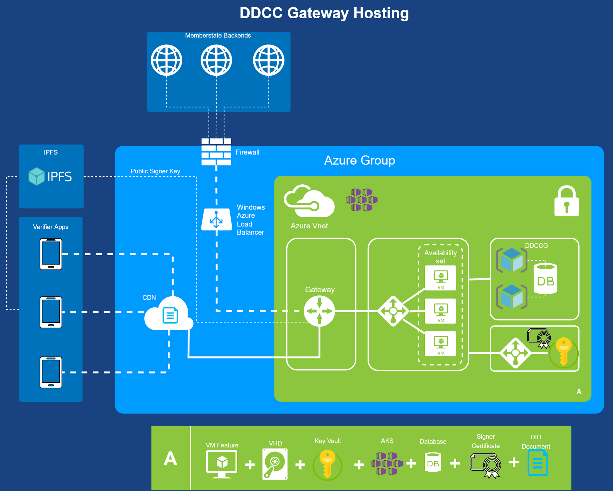

## Introduction
In the last version of the DDCCG architecture, the changes for trusted issuers and trusted certificates were made to allow different types of technologies in trust verification. This could be either X509 or DIDs according to the DID Core Specification[^1]. During the last iterations of specification and alignment with member states, there were some key points which must be additionally supported in the gateway:  

* Native DID Support for the GW Trustlists (DID Document Format)
* Decentralized Exchange of DID Documents to provide it to verifiers
* WHO aligned onboarding process for member states

The purpose of this document is to describe these changes.  
## Technical Changes

To support the did document feature according to the trust specification, the gateway will be enhanced by a did document generator and the capability to sign these did document. This contains a way to generate signing keys over a vault and register the public key of the signature over a decentralized key registry.
 

## Azure Architecture

## Onboarding Process Concept
#### Overview  

## Application Details  

The application of the member state must contain at least: 

* One or more DID or CSCA, with a statement about the correctness (will not be additionally checked), optionally SHA256 hashes of the DID Document content to anchor it
* A statement about the acceptance of keys and processes of other jurisdictions which are present in the gateway lists
* Contact Persons - Technical, Legal, Governance etc.

## Secretariat Tasks
The secretariat must handle the following tasks to establish the onboarding process: 

* Providing a Secure Channel for the member states to deliver secure and trustworthy applications and DID/CSCA informations
* Creation and Securing a Key Pair (Trust Anchor)  to sign/confirm onboarding requests for the gateway
* Delivering the Public Key of the Trust Anchor to the Gateway Operations
* Transmitting Onboarding Requests to the Gateway Operations

________________
[^1]: DID Core,   https://www.w3.org/TR/did-core/